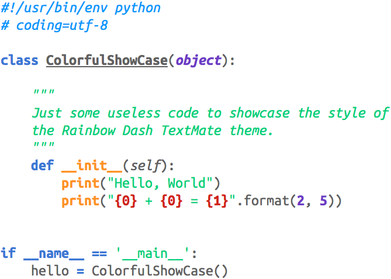

# Rainbow Dash — TextMate Theme

This repository contains a bright and colorful theme for [TextMate](https://github.com/textmate/textmate). It is based on “Mac Classic” by Chris Thomas.



# Installation

## Manual

1. Download the latest [release][].
2. Unzip the archive
3. Double click on “Rainbow Dash.tmbundle”

[release]: http://github.com/sanssecours/Rainbow-Dash.tmbundle/releases

## Terminal

```shell
mkdir -p "$HOME/Library/Application Support/TextMate/Bundles"
cd "$HOME/Library/Application Support/TextMate/Bundles"
git clone https://github.com/sanssecours/Rainbow-Dash.tmbundle
```
